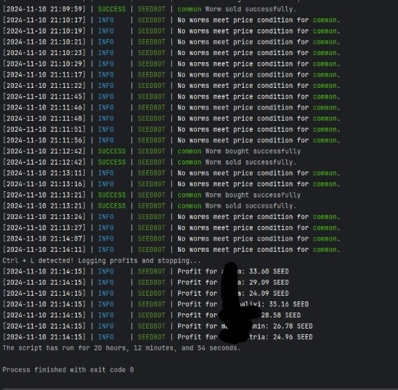
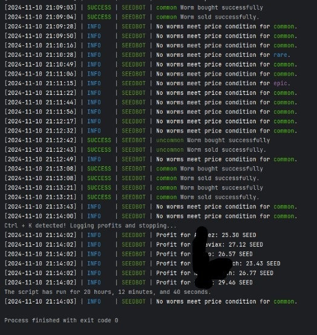

# seedcointbot
SEEDBOT is a bot built for the SeedCoin telegram bot, designed to help users earn profits by managing virtual assets. The bot automates the buying of "worms" from the game marketplace at lower prices and sells them at a higher rate, allowing the user to accumulate profits over time.

## Join Us on Telegram

For updates, support, and community discussions, join us on Telegram! 

Click the link to join: [https://t.me/+3ozlUUBMlSo2OGY0](https://t.me/+3ozlUUBMlSo2OGY0)

## Warning

**Important:**
- The more accounts you use, the higher your profit will be. It is recommended to use at least **3 accounts** for optimal performance.
- **Use this bot only on alternative accounts.** Using it on your main account could result in issues or unintended consequences.
- **By using this bot, you take full responsibility** for its use and any associated risks. We are not responsible for any consequences that may arise from using the bot.

Please proceed with caution and ensure you follow these guidelines to avoid any issues.

## Watch on youtube
[]([https://www.youtube.com/watch?v=Czd7MgxpSR4])

## Features

- Automatic worm, egg trading for profit
- Uses async operations to handle game requests
- Logging and error tracking

## Worm Types

The following table lists the supported worm types and their corresponding support status:

| Worm Type  | Support   |
|------------|-----------|
| Common     | Yes       |
| Uncommon   | Yes       |
| Rare       | Yes       |
| Epic       | Yes       |
| Legendary  | Not yet   |
| Mythic     | Not yet   |

## Egg Types

The following table lists the supported egg types and their corresponding support status:

| Egg Type   | Support   |
|------------|-----------|
| Common     | Not yet   |
| Uncommon   | Not yet   |
| Rare       | Not yet   |
| Epic       | Not yet   |
| Legendary  | Not yet   |
| Mythic     | Not yet   |


## Overview of the Script


*Overview Image 1*


*Overview Image 2*


## Installation

To set up the project on your local machine, follow these steps:

1. **Clone the repository**:
   ```bash
   git clone https://github.com/Ma1rwan/seedcointbot.git
2. **Navigate to the project directory**:
   ```bash
   cd seedcointbot
3. **Install the dependencies**:
   ```bash
    pip install -r requirements.txt
4. **Put your API_ID and API_HASH in config file**:

How to get API_ID and API_HASH ?
Watch on youtube
[](https://www.youtube.com/watch?v=XM040Gr5h1Q)

Visit this link: [telegram.org](https://my.telegram.org/auth)

5. **Execute the following command**:
   ```bash
    python main.py

6. **You have any issues?**
      Watch  [![my tutorial]]([[https://www.youtube.com/watch?v=Czd7MgxpSR4](https://www.youtube.com/watch?v=Czd7MgxpSR4)]) on youtube explaining how to install.
      Still have some issues? Fell free to visit my [telegram](https://t.me/+3ozlUUBMlSo2OGY0) and ask directly.
